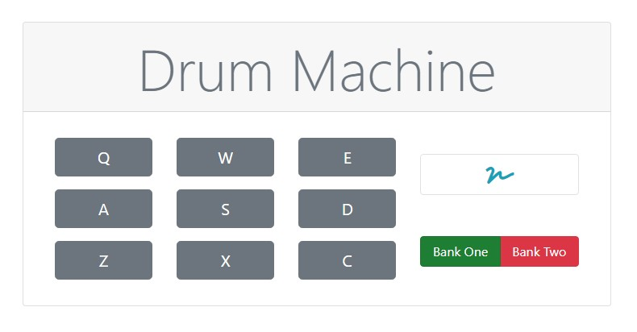
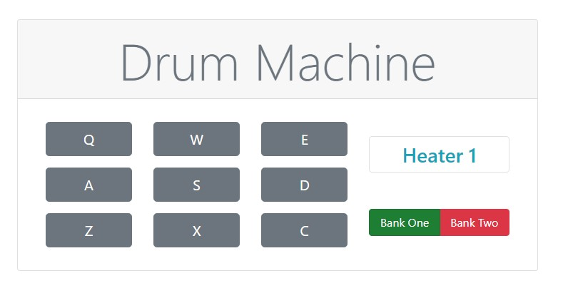

# FreeCodeCamp - Build a Drum Machine
This is part of Free Code Camp curriculum, Front End Libraries Projects - Build a Build a Drum Machine.

You can see the project page in [freeCodeCamp](https://learn.freecodecamp.org/front-end-libraries/front-end-libraries-projects/build-a-drum-machine/),
also you can view it in [codepen](https://codepen.io/xinthauro/full/MLKMGx).

## Screenshots

